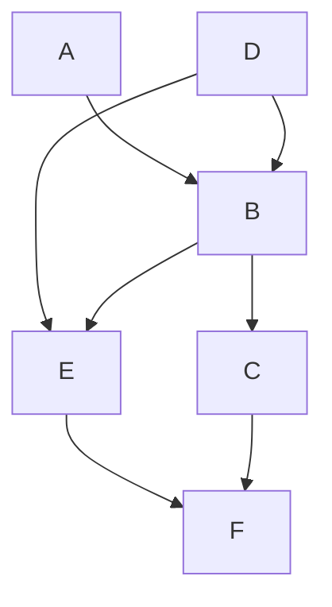

Version Control is an essential tool, because it makes your work reproducible
and visible, which can unlock profound amplifying effects for your contributions.
<!--more-->

Let me ask: are you the same person you were last year?
last month? last second?
https://en.wikipedia.org/wiki/Ship_of_Theseus

Change is eternal, even when a single individual is involved through time,
e.g.: I can't be relied upon to memorize a unique password for every account. (more on this later)

Complexity multiplies with additional people.
Hence [change management](https://en.wikipedia.org/wiki/Change_management) is an essential discipline for operators.

Unfortunately, many operators do not utilize version control and rely on pet ops and backups.

Humor: [Journal of Irreproducible Results](https://en.wikipedia.org/wiki/Journal_of_Irreproducible_Results)

Version control makes our work:
- reproducible: the essential characteristic of scientific method
- historical: full point in time recovery
- full attribution of change is recorded, i.e.: who did what
- metrics can be derived from the corpus: LoC, etc. enabling process engineering
- shareable for collaboration: democratization of work

Version control has amplifying network effects for work: (pet vs. cattle improvements)
- re-purposed: as the basis of new work (fork)
- incorporated: as a library or function or microservice of a bigger system
- scope: private to self, private to group of contributors, or...
- social: when public (with a public license), enables crowd sharing:
  - amplifying improvements via anyone with any skill set:
  - development, bug finding/fixing, testing, documentation, etc.
  - new use cases discovered, new features contributed
  - community implications and the economy of attention

Understanding version control gives you a new perspective on social systems.
You can look at operations, scientific journals, and social coding through this lens and see the same pattern.
You will also look at point to point communication and artifacts as bespoke and tactical,
contrasted to strategic, repeatable, scalable processes to improve the results.
You will also see how people try to approximate version control all over the place.

e.g.:
- Scheduling:
  - Question: do you have any time on Tuesday or Wednesday for my customer meeting? You said the afternoons were open last week.
  - Answer: Please use our corporate calendar to save time for both of us.
    - find the current, updated answer and then take action to and schedule directly,
    - while also coordinating with external resources that you represent,
    - to avoid:
      - *conflicts,*
      - getting an updated answer, then repeating the process again: question, check, answer, ACK, and then take action.
  - I copy and paste a brief version of this, sometimes with customized variations, every week!
  - Likewise: Mark, I saw your invite and even though my calendar shows I'm free:
    - something came up, I'm really out doing something else, I didn't block out travel time or lunch, it would be better on X day
      after some dependency is satisfied. Can you reschedule?
    - Can you counter-propose the better time? :)
  - Positive habits:
    - Sent calendar invites to the team for the furlough weeks.
    - Share your vacation as an invite to the team as a "free" time.
- Collaborative work: I need your help on this RFP, message, presentation, here it is in email: communication-v2-wednesday-myname.
  - Can we collaborate via Google Drive or Onedrive,
  which might also have passive version control built in
  to *avoid passing the baton* syn* problems?
- Software defects: I found a bug, let me report it in #calm
  - If you do not have JIRA training or access, that is fine.
  - For everyone else, learn and contribute your work to one of the pillars of truth at Nutanix for work management.
- Operation backups:
  - copy config.file to config.file.old.bak
  - production change:
    - identify last night's backup as your revert point for server 1...X
    - make several changes on server1
      - change monitoring alert levels, set maintenance mode, or pull out of rotation
      - make changes, e.g.: database schema, data, RBAC
      - sanity check: test the changes (in semi-isolation? depends on disruption) and proceed
      - trigger a non-disruptive backup if possible and timely without a change control window
      - restore monitoring alert levels, turn off maintenance mode, or put into rotation
    - repeat for other servers, unless you have to orchestrate combined operations across multiple servers

# History

https://nutanix.slack.com/archives/G4088HLAF/p1585093304150000

A progression from pets to cattle:

- Local or Client only: SCCS (1972), RCS (1982),
  - Cons: doesn't scale past one person without risk
- Client-Server: cvs (wrapper around RCS), svn (2000),, Perforce (1995), MSFT Visual Source Safe (1994-2005), etc.
  - Cons: requires on-line connection for a check-in to a centralized server, merge conflicts are painful
- [Distributed](https://en.wikipedia.org/wiki/Distributed_version_control):
  - Adds a staging step before pushing to a remote, anyone can be a remote (peer to peer), anyone can be offline
  - In 2010, software development author Joel Spolsky described distributed version control systems as "possibly the biggest advance in software development technology in the [past] ten years".
  - "BitKeeper was used in the development of the Linux kernel from 2002 to 2005. The development of Git, now the world's most popular version control system, was prompted by the decision of the company that made BitKeeper to rescind the free license that Linus Torvalds and some other Linux kernel developers had previously taken advantage of."

https://en.wikipedia.org/wiki/Comparison_of_version-control_software#History_and_adoption

# Git Learning Resources
- Git: https://git-scm.com/about
- https://help.github.com/en/github/getting-started-with-github/set-up-git

## First steps with git

Our first git kata will be simple: consume a public repo.

First, get git! :) Multiple ways, might be built into an IDE already.
We will use the official git CLI, it makes things explicit which a GUI or defaults can hide.

We will skip basic setup of credentials and use a fully public code repository,
e.g.: https://github.com/nutanix/calm-dsl

    git clone https://github.com/nutanix/calm-dsl.git
    git clone git@github.com:nutanix/calm-dsl.git # uses SSH

I like to create a standard working area for my local repositories:
~/Documents/$Provider/$Project/$Repo, e.g.:

- Documents/github.com/nutanix/calm-dsl/
- Documents/gitlab.com/nutanix-se/ansible/lcm-darksite-webserver
- Documents/repo.local/mysecretprojects

so it is not confusing if I'm using GitHub, GitLab, or any other instance.
I found tool that helps me navigate and enforce this convention: [ghq](https://github.com/x-motemen/ghq), e.g.:
 `ghq get nutanix/calm-dsl`

Now we have a local copy of the entire repository with it's full history.
This means we can manipulate and experiment with the repo any way we like as well as revert our changes,
and if we get in trouble, we can clone again. You are free to make mistakes and learn with revision control.

## A simple round trip: no remotes or branches

Our second git kata will start from scratch, this diagram from https://marklodato.github.io/visual-git-guide/index-en.html
shows the basic cycle from from:
- files in local, working directory
- git add # to the stage
- git commit # to the repository history
- inspecting the log and history

There are some basic terms I want to introduce:
- head
- branch
- tag
- commit hash: short and long form

    mkdir demoproject && cd $_
    git init
    git remote --verbose # note none!

    for ((i = 0; i < 5; i++)); do
      echo "Hello team, this is unchanged file${i}.txt" > file${i}.txt
    done
    ls; tree

    cat file4.txt
    git add file0.txt # added to the stage
    git commit --all --message 'This is my first commit comment!'
    git status

    git add --all
    git st # Note that we just need to specify enough to be unique, all the rest of the files are staged.
    git commit -a -m "Part 2"
    git log # note the git hash for each commit.
    cat file*txt

## Make some local changes, recover, and merge!

    vi file{2,4}.txt
    git st    # shows two modified files
    git diff  # shows modifications
    git add . # adds modified files recursively down from the current directory
    git com
    cat f*
    git mv file0.txt file5.txt
    vi file5.txt # s/change/move/
    git status
    git add *
    git status
    git commit -m "Renamed file0to5"
    git status
    git checkout 299d6550765557a46748af3e36747a219a2e50c6 #full hash
    cat f* ; vi file0.txt ; git st
    rm file0.txt ; git checkout file0.txt
    vi file0.txt && git add -a
    git commit . -m "Back to the future!"
    git checkout master
    git merge #short hash
    git log --oneline --decorate --all --graph
    TIG_DIFF_OPTS="--relative-date" tig

## Let's go public

- Create a project in Gitlab, e.g.: demoproject

        git remote add origin git@gitlab.com:mlavi/demoproject.git
        git remote --verbose
        git push --set-upstream origin master
        git remote add bb git@bitbucket.org:mlavi/demoproject.git
        git push --set-upstream bb master
- https://bitbucket.org/mlavi/demoproject/src/master/
- https://gitlab.com/mlavi/demoproject
  - Make changes on webIDE, commit
  - Changes not seen by tig or git status?

        git status
        git fetch
        get pull
        git status

  - Now they are seen!

## Open repo.local/demoproject in Atom, edit, commit, and push!

    atom .

## Clone public repo and edit from Atom

    ghq get gitlab.com/mlavi/demoproject
    git status
    atom .

## Branches

The idea for branching is to manage changes that should not block the main branch.
Long lived branches are a bad idea.

You can create a branch in a repo, make some changes there,
merge changes onto your branch periodically to keep up to date and minimize conflicts,
and finally merge your branch back, then delete your branch.

This is used for bug fixes and development of a new feature/topic.

https://agripongit.vincenttunru.com/

Branching is not an advanced topic, it is easy with git.
However, merge conflicts will always be a challenge and usually require talking to people. :)

We can talk about gitflow, etc. for branch strategies.
- https://nvie.com/posts/a-successful-git-branching-model/
- https://guides.github.com/introduction/flow/

Remember, software is designed and it resembles the organizational structure:
https://en.wikipedia.org/wiki/Conway%27s_law

## Collaboration: Forks and Pulls

From https://git-scm.com/book/en/v2/Distributed-Git-Contributing-to-a-Project
https://git-scm.com/book/en/v2/images/small-team-flow.png
and https://git-scm.com/book/en/v2/Distributed-Git-Distributed-Workflows

Let's look at https://github.com/nutanixworkshops/stageworkshop
- all the forks https://github.com/nutanixworkshops/stageworkshop/network/members
- all of the pulls https://github.com/nutanixworkshops/stageworkshop/pulls?q=is%3Apr+is%3Aclosed
- all contributors https://github.com/nutanixworkshops/stageworkshop/graphs/contributors

---
https://www.atlassian.com/git/tutorials/git-forks-and-upstreams Git tip: ahead/behind
---

https://gitgraphjs.com/stories/?path=/story/gitgraph-js-1-basic-usage--branching-from-a-past-reference
https://codepen.io/nicoespeon/pen/arqPWb?editors=1010
https://shd101wyy.github.io/markdown-preview-enhanced/#/diagrams?id=mermaid

# Today's state of the art: GitOps
c
## Learn Git Safely
1. Work locally until comfortable with the basics #failfastfixfast
2. Learn about .gitignore and use it to:
  - Isolate your pets to environment variables:
    - No credentials, ever.
    - No host names, no IP addresses, no usernames.
  - See [The 12 Factor App](https://12factor.net/) for ideal designs.
    - See also Kelsey Hightower's response: [12 Fractured Apps](https://medium.com/@kelseyhightower/12-fractured-apps-1080c73d481c)
3. Create a private repo on a Git host
   - GitHub, GitLab, BitBucket, Azure DevOps
   - OG: Sourceforge and RIP: Google CodePlex
   - Host your own: Gitea, etc.
4. After practice, make your hosted repo public
5. #crowdsource and profit!!!
