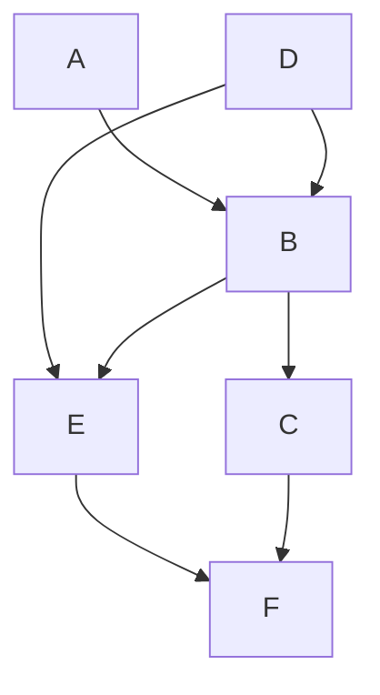

Version Control is an essential tool making your work reproducible and visible,
which can unlock profound amplifying effects of your contributions. As operators
grow into developers, they can build toward state of the art [GitOps](#gitops-the-convergence-of-devops)!
<!--more-->
__Note:__ I use revision control and version control terms interchangeably because they are synonyms.

> Sidebar: [revision history for this blog](https://github.com/mlavi/hugo/commits/master/content/post/git-for-operators.md)

# Overview: Why do we need Version Control?

Let me ask a very simple question: are you the same person you were last year? How about last month? How are you different now from one second ago?

This is a deeply philosophical question, addressed by maintenance on the [Ship of Theseus](https://en.wikipedia.org/wiki/Ship_of_Theseus) through time.

Change is eternal, even when a single individual is involved through time. *e.g.:* I can't be relied upon to memorize, expire, and update a unique [pet password](#pet-passwords) for every account on every VM on every cluster in every infrastructure provider for every project I work on! Complexity multiplies with additional people, hence [change management](https://en.wikipedia.org/wiki/Change_management) is an essential discipline for operators. Unfortunately, many operators do not utilize version control and rely on pet ops and backups for change management.

Version control makes our work:
- reproducible: an essential characteristic of the scientific method
- historical: full point in time recovery with full attribution of change is recorded, *i.e.:* who did what and when
- metrics can be derived from the corpus: Lines of Code (LoC), etc.
  enabling process engineering
- shareable for collaboration: democratization of work

Version control has amplifying network effects for work and communities
which can be summarized as pet vs. cattle improvements:
- re-purposed: as the basis of new work (fork, submodule)
- incorporated: as a library or function or microservice of a bigger system
- scope: private to self, private to group of contributors, or...
- social: when public (with a public license), enables crowd sharing:
  - amplifying improvements via anyone with any skill set:
  - development, bug finding/fixing, testing, documentation, etc.
  - new use cases discovered, new features contributed
  - community implications and the economy of attention

>Sidebar: In hindsight, I was lucky enough to start my first year of colleage on a DEC VAX system and benefit from one of the few [versioning file systems](https://en.wikipedia.org/wiki/Versioning_file_system#Files-11_(RSX-11_and_OpenVMS). One of my part-time jobs (which also became my first employer after college) also leveraged this system, so version control is an ingrained discipline and a luxury I expect.

Revision control is an essential tool to manage change, collaboration, and scale work efforts, preventing inefficient overhead of workarounds and point to point synchronization. Most operators don't realize that [GitOps](#gitops-the-convergence-of-devops) represents their future, but I see it as a refinement of and progression past [CI/CD](/post/calm.io-recap/calm.io-demystifying-continuous-integration-delivery-and-deployment/) for "invisible ops."

## Example Problems and Approximating Version Control

Understanding version control gives you a new perspective on social systems. You can look at operations, scientific journals, and social coding through this lens and see the same pattern. Point to point communication and artifacts are bespoke and tactical, contrasted to strategic, repeatable, scalable processes to improve results. People regularly approximate version control all over the place.

> Humor sidebar: [Journal of Irreproducible Results](https://en.wikipedia.org/wiki/Journal_of_Irreproducible_Results)

What follows is a combination of rants and constructive criticism, *e.g.:*

- Scheduling:
  - Question: do you have any time on Tuesday or Wednesday for my customer meeting? You said the afternoons were open last week.
  - Answer: Please use our corporate calendar to save time for both of us.
    - Find the current, updated answer (*sync on availability*) and then take action to schedule directly,
    - while also coordinating with external resources that you represent, to avoid *conflicts.*
    - Otherwise, we must resort to you getting an updated answer and potentially repeating the process again:
    question, check, answer, ACK, and then take action.
      - I copy and paste a brief version of this, sometimes with customized variations, every week!
    - Variation on the same problem:
      - I saw your invite and even though my calendar shows I'm free:
        - something came up, I'm really out doing something else,
        - I didn't block out travel time or lunch, it would be better on X day
        - it would be better that we meet after some dependency is satisfied.
      - *i.e.:* I have a resource availability *conflict.* Can you reschedule the appointment?
      - Answer: sure, but given that you can best represent your constraints,
        could you counter-propose a better time for both of us? :)
  - Positive habits:
    - Sent calendar invites to the team for the furlough weeks.
    - Share your vacation as an invite to the team as a "free" time.
- Collaborative work:
  - Question: I need your help on this {RFP, message, presentation}, here it is in email: `communication-v2-wednesday-myname`.
  - Answer: Can we collaborate via Google Drive or Onedrive, which might also have passive version control built in to avoid passing the baton *sync* problems?
- Software defects:
  - Question: I found a bug, let me verbally report it in #productname channel.
  - Answer: If you do not have JIRA training or access, that is fine.
    - For everyone else, learn and directly contribute your work to one of the pillars of truth at Nutanix for work management.
- Operations, *e.g.:*
  - Copy config.file to config.file.old.bak
  - Production change procedure:
    - identify last night's backup as your revert point for server 1...X
    - make several changes on server1
      - change monitoring alert levels, set maintenance mode, or pull out of rotation
      - make changes, *e.g.:* database schema, data, RBAC
      - sanity check: test the changes (in semi-isolation? depends on disruption) and proceed
      - trigger a non-disruptive backup if possible and timely without a change control window
      - restore monitoring alert levels, turn off maintenance mode, or put into rotation
    - repeat for other servers, unless you have to orchestrate combined operations across multiple servers
  - All of these are workarounds for *reverting a change* and reveal the need for revision control.

# Poll: Know your Peers

I asked my colleagues via a [poll in #xpert-automation (population 242)](https://nutanix.slack.com/archives/G4088HLAF/p1585093304150000):
"I can collaborate using public Git:"
- Of 16 responses, ~1/3 request training
- the remainder list their public repos:
  1. https://github.com/thombrown
  2. https://github.com/pipoe2h
  3. https://github.com/akbaraziz
  4. https://github.com/rehmert
  5. https://github.com/gabybeitler
  6. https://github.com/yannickstruyf3
  7. https://github.com/sbourdeaud/nutanix
  8. https://github.com/aadis
  9. https://github.com/MichaelHaigh/
  1. mlavi@{github, gitlab, bitbucket}

and this tutorial started soon thereafter.

# Glossary of Contextual Terms

It is easiest to think of revision control as managing the changes to a project
folder of text files, so I'll define terms in that context, however there are
more formal and abstract answers for many of the following terms.

## Generic

Repository (repo)
: a logical "parent folder" for a project's content.

Commit
: a change placed into the history of the project.

Diff (difference)
: the delta between the previous and current state of the project.
  - Note that this could be multiple changes and operations across multiple files.

Merge Conflict
: local changes collide with the committed state of a remote repo (shared resource diff conflict),
  so the commit is blocked until either or both sides can resolve, sync updates, and try again.

HEAD
: a pointer to the where the next commit will go, normally the latest commit.
  However, this can be changed to go back in history for point in time reconstruction.

Branch
: a complete copy of the repo contents (it is contained in the repo with it's own HEAD), used to prevent changes from impacting the master or main branch.
  - Typically used for non-blocking work as experiments, historical releases (can be simulated with Tag), and hotfix/patches.
  - Challenge:
    - continually merge each branch from main branch to minimize potential merge conflicts when eventually ending a branch.
    - Lifecycle of a branch to prevent increase the repo overhead due to branch sprawl.
  - Branches benefit from increased collaboration versus an uncoordinated clone of the repo.

Master or mainline
: the branch where all work is coordinated for release. When there are no branches, this is implicit.

## Git
Stage
: local changes are added into a commit, providing granular control across the repo and planning reversible change sets.

Hash (Short vs. Long)
: a commit identifier, the short version is a truncated long (full) hash.

Remote
: a destination endpoint for your local repo

Push
: send updates to a remote (branch), *e.g.:* `git push origin master`

.gitignore
: a list of files and file patterns to omit when adding files to the stage. See: https://gitignore.io/

Tags and Releases
: meta data applied to a branch commit

Gitflow and GitHub Flow
: branching strategies, see the [branches](#branches) section, below.

GitOps
: operations triggered by git, see the [GitOps](#gitops-the-convergence-of-devops) section, below.

## Public git hosting
Fork
: a linked copy/clone of a repo for collaboration without requiring commit access to a repo.
  - It can be thought of a one way, entire repo branch/remote, but that's not entirely accurate
  because although there is repo linkage (*e.g.:* this downstream fork is X commits behind upstream repo)
  there is no requirement for coordination aside from initial access to create the fork. Example uses:
  - maintain an abandoned repo.
  - when there is a divorce in culture and separation of work.

Pull request
: process reconcile a fork and the upstream/original repo, a commit in the fork is targeted for merge.
  - This starts a collaborative review process by the repo admins or their proxies
  with potentially many stages of interaction resulting in partial or complete acceptance or rejection.

# Revision Control History
A progression from pets to cattle:

- Local (client only): SCCS (1972), RCS (1982),
  - Cons: doesn't scale past one person without risk
- Client-Server: cvs (wrapper around RCS), svn (2000),, Perforce (1995), MSFT Visual Source Safe (1994-2005), etc.
  - Cons: requires on-line connection for a check-in to a centralized server, branch and merge conflicts are painful
  - Pros: two stages for work (update sync and commit), single source of truth (centralized server)
- [Distributed](https://en.wikipedia.org/wiki/Distributed_version_control):
  - Adds a staging step before pushing to a remote
    Pros: anyone can be a remote (peer to peer), facilities offline development
    Cons: multiple stages of work (fetch/pull, stage, commit, push) takes adjustment from previous generation, there can be multiple sources of truth requiring coordination (most operate with a single remote and approximate the previous generation of client-server).
  - In 2010, software development author Joel Spolsky described distributed version control systems as "possibly the biggest advance in software development technology in the [past] ten years".
  - "BitKeeper was used in the development of the Linux kernel from 2002 to 2005. The development of Git, now the world's most popular version control system, was prompted by the decision of the company that made BitKeeper to rescind the free license that Linus Torvalds and some other Linux kernel developers had previously taken advantage of."

https://en.wikipedia.org/wiki/Comparison_of_version-control_software#History_and_adoption

# Git Learning Resources
- Git: https://git-scm.com/about
- Check all the Git hosting companies for tutorials:
  - GitHub (MSFT), GitLab, BitBucket (Atlassian), Azure DevOps (MSFT)
  - [Getting started with GitHub: Set up Git](https://help.github.com/en/github/getting-started-with-github/set-up-git)
  - OG: Sourceforge and RIP: Google CodePlex
- LMGTFY: git tutorial
  - Search YouTube, etc. – there is a lot out there!
  - StackOverflow has lots of help to get you out of a pinch!
- GTS 2020: [CI/CD Lab with Calm+Karbon](https://nutanix.handsonworkshops.com/workshops/73114240-32b0-4999-b9c9-42bdc02dc5bb/view/calm_karbon_cicd/calm_karbon_cicd/)

# FAQ

Q: Can you give an example of how Git helps a Sales Engineer (or operator)?
A: Take a look at the [Collaboration](#collaboration-pulls-forks-and-submodules) section,
   where the bootcamp automation scripts save SEs multiple hours for any demo or
   experiment, preventing mistakes when setting up a new cluster for a bootcamp, Global Tech Summit, etc.
   and were the basis or contributed to GTS2019 EMEA and APAC hackathon winners.
   This work has paid off 10,000 times the investment, enabled thousands of SEs,
   saved immeasurable SE hours, powered uncountable demos, and continues to improve for more use cases/labs.

Q: Is git (or any revision control system) good for storing large files: videos, pictures, etc.
A: It depends on the context: if you are completely local for your private use, go for it! However there are systems like [Git Large File Storage](https://git-lfs.github.com/) and [git-annex](https://git-annex.branchable.com/) that are better suited for git to manage the (textual) metadata of large files across multiple file sources and backups.

   Ultimately, the answer is no: revision control is best suited for text files
   (source code, configuration, scripts, documentation, etc.), not BLOBs to deal
   with textual diffs and merges. So we arrive at the idea to store the procedure to build the application in git, not the application binary or libraries.
   You will see public git host providers restrict the size of an individual
   file in a repo and sometimes the total size of a repo to enforce these rules
   in order to keep their SLAs. free tier, and capacity planning as well as
   to prevent spillover from becoming a file host provider
   (*e.g.:* DropBox, OneDrive, GDrive, Netapp, S3, Files/Objects, etc.).

Q: If we shouldn't store credentials and other hard coded pets in revision control, where should they go?
A: It depends what the best source of truth should be for each pet. Because you have revision control, you can safely refactor towards improving your processes and easily revert any experiment as you learn.

   So try to answer each question, how do you manage your cattle of:
   - IP addresses: try to move to DHCP and IPAM systems to get rid of them.
      Remember this indicates the need to adopt the category of service discovery
      and service addressing (DNS) solutions.
   - Passwords: see [Pet Passwords](#pet-passwords), below. Markdown doesn't handle HTML anchors gracefully.
   - Binary artifacts: drive to
      - filers NFS/SBM/FTP/SFTP and filer hosting
      - artifact management (Nexxus, Artifactory) specific to the artifact for metadata and post processing
        - language libaries/installs
        - Docker container registry
        - etc.
    - See [The 12 Factor App](https://12factor.net/) for ideal design principles.
      - Kelsey Hightower's response/examples: [12 Fractured Apps](https://medium.com/@kelseyhightower/12-fractured-apps-1080c73d481c)

Q: How does one decide on project repo organization?
A: This is a huge indicator of engineering culture, *e.g.:* monoculture = one repo for everything versus fragmentation over too many repos. There is a project life cycle to consider as well.

## Pet Passwords

Death to the static password on one user login on one OS, work to move or drive them towards:
- environment variable files and add those files to .gitignore
- synthesize variable files from your cattle systems
  - Pupper Hiera, Chef databags, etcd/database stores, Vault
  - local secret repos (keyring, KeepassXC, etc.)
  - authentication systems (LDAP, OAUTH, SAML, SSO/WebSSO)
- from static passwords to ephemeral passwords/accounts: synthesized for the lifecycle of the app or user session
  - SSH keys, then ephemeral keys
  - from credentials to dynamic, session tokens (JWT, etc.)

See the [Postscript: Securing Pets in Git](#2020-04-19-securing-pets-in-git) for my journey in some more detail!

---

# Git Tutorial

## First steps with git (completely local and safe)

Our first git kata will be simple: consume a public repo.

First, get git! :) There are multiple ways and it might be built into your editor or IDE: Integrated Development Environment already. We will use the official git CLI because it can makes things explicit, which a GUI or defaults can hide, or worse, there may be basic git operations that some GUIs cannot easily handle.

We will skip basic setup of credentials and use a fully public code repository,
*e.g.:* https://github.com/nutanix/calm-dsl

    git clone https://github.com/nutanix/calm-dsl.git
    git clone git@github.com:nutanix/calm-dsl.git # uses SSH

I like to create a standard working area for my local repositories:
~/Documents/$Provider/$Project/$Repo, *e.g.:*

- Documents/github.com/nutanix/calm-dsl/
- Documents/gitlab.com/nutanix-se/ansible/lcm-darksite-webserver
- Documents/repo.local/mysecretprojects

so it is not confusing when using GitHub, GitLab, or any other instance.
I found a tool that helps me navigate and enforce this convention:
[ghq](https://github.com/x-motemen/ghq),
*e.g.:* `ghq get nutanix/calm-dsl` versus `git clone https://github.com/nutanix/calm-dsl.git`.

However, ghq defaults to https:// URLs, which can be a problem if you want to use SSH (git:) method,
which is advisable for git hosting requiring two factor authentication.

Now we have a local copy of the entire repository with it's full history.
This means we can experiment with the repo any way we like, even revert our changes,
and if we get in trouble, we can clone again. You are free and safe to make mistakes
as you learn revision control. #failfastfixfast

## A simple round trip into history: no remotes or branches

Our second git kata will start from scratch, this diagram from https://marklodato.github.io/visual-git-guide/index-en.html
shows the basic cycle from:
- files in local, working directory
- `git add` files to the stage
- `git commit` files to the repository history
- inspecting the commit history log

There are some basic terms I want to introduce,
 see the [#glossary](#glossary-of-contextual-terms) for more detail:
- head: pointer to the latest commit
- branch: we're going to see this used indirectly
- commit hash: short and long form

    mkdir demoproject && cd $_
    git init
    git remote --verbose # note none!

    for ((i = 0; i < 5; i++)); do
      echo "Hello team, this is unchanged file${i}.txt" > file${i}.txt
    done
    ls; tree

    cat file4.txt
    git add file0.txt   # add to the stage
    git commit --message 'This is my first commit comment!'
    git status          # Note we are on a the default branch; it is named master

    git add --all       # recurse child directories
    git status          # see all remaining files staged
                        # "git st" works on Linux, not Mac!
    git commit -m "Part 2"
    git log # note the git hash for each commit.

### Make some changes
    cat file*txt
    vi file{2,4}.txt
    git status  # shows two modified files
    git diff    # shows modifications
    git add .   # adds modified files recursively down from the current directory
    git commit # will use $EDITOR and omit #comment lines
    cat f*
    git mv file0.txt file5.txt  # Git Operation
                # preserves change history
                # vs. pet op loses history = delete and add
    vi +/change file5.txt # :s/change/move/
    git status
    git add * # lots of ways to do similar things, however not recursive
    git status
    git commit -m "Renamed file0to5"
    git st

### Go back in time
    git log                # pick a point in time
    git checkout master~3  # go back -3 commits or specify commit hash
    cat f* ; vi file0.txt ; git status

### Recover accidental deletion
    rm file0.txt
    ls        # file0.txt is gone
    git checkout file0.txt
    tree      # file0.txt is back from history

### Make a detached head change on the past, merge into the present
    vi file0.txt && git add -a
    git commit -m "Back to the future!"
    git checkout master   # Note: $ShortHash of detached head
    git merge $ShortHash
    cat file5.txt # note: both the detached head change and rename operation!

    git log --oneline --decorate --all --graph  # branch visualization (text)
    TIG_DIFF_OPTS="--relative-date" tig         # I like this TUI

### Protect yourself with .gitignore
    echo "file6.txt" > .gitignore && git add . && git commit -m 'ignore file6.txt'
    echo "secret" > file6.txt
    git status
    git add . && git commit # nothing to commit because file6.txt is .gitignore(d)!

## Let's go public

Working with a remote repo is as simple as fetch and pull to synchronize state "down" to your local repo before you push your changes "up" to the remote repo. You can specify your choice of destination or source remote and repo branch. __failfastfixfast:__ I am working on making this image clearer, *sorry for the blurriness!*

Hosted git providers generally organize repositories with a organization/team/group and then the project repo under them, *e.g.:* nutanix/blueprints. For personal projects, your username is the organization, *e.g.:* mlavi/demoproject

- Create a project in Gitlab, *e.g.:* demoproject = https://gitlab.com/mlavi/demoproject

- Add a remote with an alias or name of "origin," then set it as a push destination.

        git remote add origin git@gitlab.com:mlavi/demoproject.git
        git remote --verbose
        git push --set-upstream origin master

  - TODO:

        git remote add bb git@bitbucket.org:mlavi/demoproject.git
        git push --set-upstream bb master
        git push bb # https://bitbucket.org/mlavi/demoproject/src/master/

- Make changes with the webIDE and commit them.
  - Changes not seen by `git status` or tig?

        git status
        git fetch #from the remote
        git pull  #from the remote
        git status

  - Now they are seen!

### Open repo.local/demoproject in Atom, edit, commit, and push!

    atom .

### Clone public repo and edit from Atom

    ghq get gitlab.com/mlavi/demoproject
    git status
    atom .

# Branches

We've seen that every repo is initialized with a default branch named master (unless specified otherwise). It is sometimes called the mainline branch and while it is arbitrarily important, but by convention for many projects, it is where attention is focused to keep it stable from risky changes.

Branching allows anyone to manage changes that should not block the main branch stability. Long lived branches are usually a bad idea and should be discarded as soon as possible to avoid larger merge conflicts due to drift. Branches usually represent different types of shorter lived work: experiments, a bug fix, a new feature, refactoring, and so on. Sometimes branches are referred to as topic branches to highlight their focused, short lived scope.

You can create a branch in a repo, make some changes there, and commit changes onto your topic branch. It is ideal to merge changes from master onto your branch periodically to keep it up to date and minimize merge conflicts down the line.
The final stage of a branch lifecycle is to merge your branch to master and then delete the topic branch.

A nice visualization of branching: https://agripongit.vincenttunru.com/

Branching is not an advanced topic and it is easy with git. However, merge conflicts will always be a challenge and usually requires talking to people. :) In other revision control systems, branches could be used to indicate and preserve
the state of the repo for a release, but git can accommodate this with a simple tag applied to a commit.

We can talk about different branch strategies:
- [GitFlow](https://nvie.com/posts/a-successful-git-branching-model/): for more traditional software engineering release models
- GitHub Flow: [Overview](https://git-scm.com/book/en/v2/GitHub-Contributing-to-a-Project) || [Source](https://guides.github.com/introduction/flow/)

Remember, software is designed and it resembles the organizational structure:
https://en.wikipedia.org/wiki/Conway%27s_law

# Collaboration: Pulls, Forks, and Submodules

Take a look at this diagram from [Contributing to a Project](https://git-scm.com/book/en/v2/Distributed-Git-Contributing-to-a-Project):  and diagrams in [Distributed Git - Distributed Workflows](https://git-scm.com/book/en/v2/Distributed-Git-Distributed-Workflows).

Let's look at https://github.com/nutanixworkshops/stageworkshop and review all of the: [forks](https://github.com/nutanixworkshops/stageworkshop/network/members), [pulls](https://github.com/nutanixworkshops/stageworkshop/pulls?q=is%3Apr+is%3Aclosed), [contributors](https://github.com/nutanixworkshops/stageworkshop/graphs/contributors).

With out of the box git, you get all or nothing access to the full repository contents: branches, tags, and history. The only manner to source external work is through [git submodules](https://git-scm.com/book/en/v2/Git-Tools-Submodules), which can be challenging to maintain because they require manual synchronization, just like merges.

However, there are valuable extensions (not part of the git toolset) for distributed collaborative efforts of software projects by hosted git providers. RBAC: Role Based Access Control, such as read only versus contributor only on a certain branch. *To be confirmed:* Forks and pull requests are git provider specific.

# GitOps: the Convergence of Dev+Ops

We saw the benefit of git operations on our repo in the example: it replayed a file update and file move. Today, when every system has a REST API, automation of every operation can be possible, removing pet ops.

- No human touching anything BUT git!
  - Every configuration is under revision control
  - Process is triggered by a git operation
  - Every process is also in git (*e.g.:* Jenkinsfile build job, Dockerfile build, webhooks, scripts, blueprints, etc.)
- Git commit a change and make a pull request to a branch that represents an environment:
  - Master = production
  - Staging, dev, QA, etc.
- History: WeaveWorks = makers of Calico, this will be the next generation of Karbon's networking feature
  - 2017-08-07: [weave.works/blog/gitops-operations-by-pull-request](https://www.weave.works/blog/gitops-operations-by-pull-request)
  - 2018-08-21: [weave.works/blog/what-is-gitops-really](https://www.weave.works/blog/what-is-gitops-really)

# Learn Git Safely
1. Work locally until comfortable with the basics. #failfastfixfast
  - git status and git log are your friends and provide sanity checks
  - I use status frequently: `alias gits='git status --short --branch && echo'`
    and I've adjusted my shell prompt to reflect it as well!
2. Learn about .gitignore and use it to:
  - Isolate your pets to environment variables:
    - No credentials, ever.
    - No host names, no IP addresses, no usernames.
3. Create a private repo on a Git host
   - GitHub, GitLab, BitBucket, Azure DevOps, Sourceforge, etc.
   - Host your own: [Gitea](https://en.wikipedia.org/wiki/Gitea), etc.
4. After practice, make your (hosted) repo public
5. Work towards [CI/CD](/post/calm.io-recap/calm.io-demystifying-continuous-integration-delivery-and-deployment/) and GitOps!
5. #crowdsource and profit!!!

# Conclusion

Constantly look how to make your pet work become 100X more effective as cattle.
- Adopt the mantra: "Git or it didn't happen."
- Refactor your lifestyle for reproducible cattle processes!
- Drive towards GitOps, most of the world doesn't know about it yet!

---
# 2020-04-01: Postscript and Appendix TODO
I will continue to publish updates as I flush out and refine this material.

In the initial demo, I contrasted a filesystem rename to a git mv operation (I joked that this was the first step to GitOps), then repointed HEAD to an earlier point in time (detached HEAD situation, almost a branch), and made a change to that file (before it was renamed). When I went back to master branch and merged the short hash of the detached HEAD, we saw that the file changed AND was renamed (*e.g.:* a git pull fast forward).

Finish [#collaboration-pulls-forks-and-submodules](#collaboration-pulls-forks-and-submodules)

- https://www.atlassian.com/git/tutorials/git-forks-and-upstreams Git tip: ahead/behind
- https://gitgraphjs.com/stories/?path=/story/gitgraph-js-1-basic-usage--branching-from-a-past-reference
- https://codepen.io/nicoespeon/pen/arqPWb?editors=1010
- https://shd101wyy.github.io/markdown-preview-enhanced/#/diagrams?id=mermaid

# 2020-04-19: Securing Pets in Git

I began my [Dotfiles](https://github.com/webpro/awesome-dotfiles) journey when I began refactoring my work from a Macbook Air to a Dell XPS running [Linux Mint](https://www.linuxmint.com/) (akin to the XPS Developer Edition/Project Sputnik). I love the Mac, but the battery and keyboard were failing, and I had wanted to make Linux my primary OS for years. I prepared by driving towards cross-platform, web, and open source applications as much as possible.

I had been successful making my home directory portable across OS updates on my Linux desktop, making my data somewhat OS version independent. Rather than just migrate with a one-time lift and shift from Mac to Linux, it took time to make my work portable. I ended up where I could go back and forth between laptops as needed to have the best of both worlds. e.g.: I still need the Mac for PowerPoint, but I may get around that with Frame IT desktop, dual-booting to Windows, or running a Windows VM.

Dotfiles are primarily text, therefore revision control is a more logical choice over file sync for collaboration across machines and for backups. As soon as I settled on a [dotfile manager](https://github.com/webpro/awesome-dotfiles), I began to put my work into a local Git repo. The first dotfile manager I tried had GPG encryption; I didn't stick with it long enough to take advantage of that feature; however, it set a valuable expectation for transparent encryption. I continued to document my Mac setup, placing it under revision control. As I placed more into the local repo, I eventually added and pushed to a hosted, private repo to and test my work on the Linux laptop.

For my standards, a private hosted repo and security in transit wasn't enough to secure valuable information. I had lots of valuable pets such as: username, password, IP address, hostname, account number, install location path names, etc. I wanted to prevent accidental leakage of secrets and I tackled the problem in two stages.

For the first stage, I researched GPG and wanted to coordinate that with e-mail (which is an ongoing project). I settled on an easier initial step with transparent, team-based git encryption: [Transcrypt](https://github.com/elasticdog/transcrypt) is open source and cross platform enough. :) This solution allowed me to safely add my pet files with hard coded work while I continued to refactor them in the second stage.

For the second stage, I searched for an off-line password manager for storing credentials and other confidential information for all my pets! I didn't want to trust an online, cloud, SaaS service to accidentally breach my secrets, e.g.: this happens regularly with credit cards. Furthermore, it was important that the app was open source, cross platform, and had web browser integration. This would allow me to refactor everything into a common store: all pet credentials, in a pet profile, in a pet browser, under a pet account, on a pet OS.

I will elaborate on the search candidates and stack rank ordering another time, but [KeepassXC](https://keepassxc.org) satisfied most of my requirements and won my loyalty due to design values, regular updates, and an [endorsement by the EFF](https://ssd.eff.org/en/module/how-use-keepassxc). While the credential file store is encrypted by pass phrase (Transcrypt doubly protects it for some defense in depth), it derives from a well known file format, allowing alternative GUI and web browser plug-in/extensions. Finally, the app fairly gracefully handles changes from file sync and I have gotten my conflict resolution process under control. So I have been happy to continually refactor my hard-coded pets into the credential file store and leverage updates across several machines and apps.

Finally, not only are my secrets portable across machines and apps, but now I've begun to generate pet configuration files to populate environment variables from my store. This keeps pets out of binaries, configuration files, and Git as much as possible! It is a matter of time to drive this effort towards LDAP, Kerberos, Vault, etc. for service based pets and ephemeral, dynamic session tokens and passwords with audit logs as listed in [pet password](#pet-passwords).
