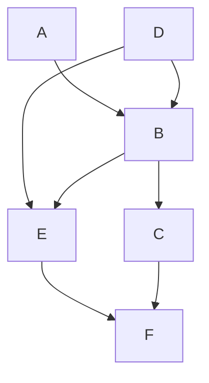

Version Control is an essential tool, because it makes your work reproducible
and visible, which can unlock profound amplifying effects for your contributions.
It also builds to state of the art GitOps!
<!--more-->

Let me ask: are you the same person you were last year?
last month? last second?
https://en.wikipedia.org/wiki/Ship_of_Theseus

Change is eternal, even when a single individual is involved through time,
e.g.: I can't be relied upon to memorize a unique password for every account. (more on this later)

Complexity multiplies with additional people.
Hence [change management](https://en.wikipedia.org/wiki/Change_management) is an essential discipline for operators.

Unfortunately, many operators do not utilize version control and rely on pet ops and backups.

Humor: [Journal of Irreproducible Results](https://en.wikipedia.org/wiki/Journal_of_Irreproducible_Results)

Version control makes our work:
- reproducible: the essential characteristic of scientific method
- historical: full point in time recovery
- full attribution of change is recorded, i.e.: who did what
- metrics can be derived from the corpus: LoC, etc. enabling process engineering
- shareable for collaboration: democratization of work

Version control has amplifying network effects for work: (pet vs. cattle improvements)
- re-purposed: as the basis of new work (fork)
- incorporated: as a library or function or microservice of a bigger system
- scope: private to self, private to group of contributors, or...
- social: when public (with a public license), enables crowd sharing:
  - amplifying improvements via anyone with any skill set:
  - development, bug finding/fixing, testing, documentation, etc.
  - new use cases discovered, new features contributed
  - community implications and the economy of attention

Understanding version control gives you a new perspective on social systems.
You can look at operations, scientific journals, and social coding through this lens and see the same pattern.
You will also look at point to point communication and artifacts as bespoke and tactical,
contrasted to strategic, repeatable, scalable processes to improve the results.
You will also see how people try to approximate version control all over the place.

What follows is really a combination of rants and constructive criticism, e.g.:
- Scheduling:
  - Question: do you have any time on Tuesday or Wednesday for my customer meeting? You said the afternoons were open last week.
  - Answer: Please use our corporate calendar to save time for both of us.
    - Find the current, updated answer (*sync on availability*) and then take action to schedule directly,
    - while also coordinating with external resources that you represent, to avoid *conflicts.*
    - Othewise, we must resort to you getting an updated answer and potentially repeating the process again:
    question, check, answer, ACK, and then take action.
      - I copy and paste a brief version of this, sometimes with customized variations, every week!
    - Variation on the same problem:
      - I saw your invite and even though my calendar shows I'm free:
        - something came up, I'm really out doing something else,
        - I didn't block out travel time or lunch, it would be better on X day
        - it would be better that we meet after some dependency is satisfied.
      - i.e.: I have a resource availability *conflict.* Can you reschedule the appointment?
      - Answer: sure, but given that you can best represent your constraints,
        could you counter-propose a better time for both of us? :)
  - Positive habits:
    - Sent calendar invites to the team for the furlough weeks.
    - Share your vacation as an invite to the team as a "free" time.
- Collaborative work:
  - Question: I need your help on this {RFP, message, presentation}, here it is in email:
    communication-v2-wednesday-myname.
  - Answer: Can we collaborate via Google Drive or Onedrive,
    which might also have passive version control built in
    to avoid passing the baton *sync* problems?
- Software defects:
  - Question: I found a bug, let me verbally report it in #productname channel.
  - Answer: If you do not have JIRA training or access, that is fine.
    - For everyone else, learn and directly contribute your work to one of the pillars of truth at Nutanix for work management.
- Operations, e.g.:
  - Copy config.file to config.file.old.bak
  - Production change procedure:
    - identify last night's backup as your revert point for server 1...X
    - make several changes on server1
      - change monitoring alert levels, set maintenance mode, or pull out of rotation
      - make changes, e.g.: database schema, data, RBAC
      - sanity check: test the changes (in semi-isolation? depends on disruption) and proceed
      - trigger a non-disruptive backup if possible and timely without a change control window
      - restore monitoring alert levels, turn off maintenance mode, or put into rotation
    - repeat for other servers, unless you have to orchestrate combined operations across multiple servers
  - All of these are workarounds for *reverting a change* and reveal the need for revision control.

# Poll: Know your Peers
[Poll in #xpert-automation (population 242)](https://nutanix.slack.com/archives/G4088HLAF/p1585093304150000):
"I can collaborate using public Git" results:
- Of 16 responses, ~1/3 request training
- the remainder list their public repos:
  1. https://github.com/thombrown
  2. https://github.com/pipoe2h
  3. https://github.com/akbaraziz
  4. https://github.com/rehmert
  5. https://github.com/gabybeitler
  6. https://github.com/yannickstruyf3
  7. https://github.com/sbourdeaud/nutanix
  8. https://github.com/aadis
  9. https://github.com/MichaelHaigh/
  1. mlavi@{github, gitlab, bitbucket}

# Glossary of Contextual Terms

It is easiest to think of revision control as managing the changes to a project folder of text files,
so I'll define terms in that context, however there are more formal and abstract answers for many terms.

## Generic:

Repository (repo)
: a logical "parent folder" for a project's content.

Commit
: a change placed into the history of the project.

Diff (difference)
: the delta between the previous and current state of the project.
  - Note that this could be multiple changes and operations across multiple files.

Merge Conflict
: local changes collide with the committed state of a remote repo (shared resource diff conflict),
  so the commit is blocked until either or both sides can resolve, sync updates, and try again.

HEAD
: a pointer to the where the next commit will go, normally the latest commit.
  However, this can be changed to go back in history for point in time reconstruction.

Branch
: a complete copy of the repo contents (it is contained in the repo with it's own HEAD), used to prevent changes from impacting the master or main branch.
  - Typically used for non-blocking work as experiments, historical releases (can be simulated with Tag), and hotfix/patches.
  - Challenge:
    - continually merge each branch from main branch to minimize potential merge conflicts when eventually ending a branch.
    - Lifecycle of a branch to prevent increase the repo overhead due to branch sprawl.
  - Branches benefit from increased collaboration versus an uncoordinated clone of the repo.

Master or mainline
: the branch where all work is coordinated for release. When there are no branches, this is implicit.

## Git:
Stage
: local changes are added into a commit, providing granular control across the repo and planning reversible change sets.

Hash (Short vs. Long)
: a commit identifier, the short version is a truncated long (full) hash.

Remote
: a destination endpoint for your local repo

Push
: send updates to a remote (branch), e.g.: `git push origin master`

.gitignore
: a list of files and file patterns to omit when adding files to the stage. See: https://gitignore.io/

Tags and Releases
: meta data applied to a branch commit

Gitflow and GitHub Flow
: branching strategies, see references.

GitOps
: see [section](#GitOps), below.

## Public git hosting:
Fork
: a linked copy/clone of a repo for collaboration without requiring commit access to a repo.
  - It can be thought of a one way, entire repo branch/remote, but that's not entirely accurate
  because although there is repo linkage (e.g.: this downstream fork is X commits behind upstream repo)
  there is no requirement for coordination aside from initial access to create the fork. Example uses:
  - maintain an abandoned repo.
  - when there is a divorce in culture and separation of work.

Pull request
: process reconcile a fork and the upstream/original repo, a commit in the fork is targeted for merge.
  - This starts a collaborative review process by the repo admins or their proxies
  with potentially many stages of interaction resulting in partial or complete acceptance or rejection.

# Revision Control History
A progression from pets to cattle:

- Local (client only): SCCS (1972), RCS (1982),
  - Cons: doesn't scale past one person without risk
- Client-Server: cvs (wrapper around RCS), svn (2000),, Perforce (1995), MSFT Visual Source Safe (1994-2005), etc.
  - Cons: requires on-line connection for a check-in to a centralized server, branch and merge conflicts are painful
  - Pros: two stages for work (update sync and commit), single source of truth (centralized server)
- [Distributed](https://en.wikipedia.org/wiki/Distributed_version_control):
  - Adds a staging step before pushing to a remote
    Pros: anyone can be a remote (peer to peer), facilities offline development
    Cons: multiple stages of work (fetch/pull, stage, commit, push) takes adjustment from previous generation, there can be multiple sources of truth requiring coordination (most operate with a single remote and approximate the previous generation of client-server).
  - In 2010, software development author Joel Spolsky described distributed version control systems as "possibly the biggest advance in software development technology in the [past] ten years".
  - "BitKeeper was used in the development of the Linux kernel from 2002 to 2005. The development of Git, now the world's most popular version control system, was prompted by the decision of the company that made BitKeeper to rescind the free license that Linus Torvalds and some other Linux kernel developers had previously taken advantage of."

https://en.wikipedia.org/wiki/Comparison_of_version-control_software#History_and_adoption

# Git Learning Resources
- Git: https://git-scm.com/about
- Check all the Git hosting companies for tutorials:
  - GitHub (MSFT), GitLab, BitBucket (Atlassian), Azure DevOps (MSFT)
  - [Getting started with GitHub: Set up Git](https://help.github.com/en/github/getting-started-with-github/set-up-git)
  - OG: Sourceforge and RIP: Google CodePlex
- LMGTFY: git tutorial
  - Search YouTube, etc. – there is a lot out there!
  - StackOverflow has lots of help to get you out of a pinch!
- GTS 2020: [CI/CD Lab with Calm+Karbon](https://nutanix.handsonworkshops.com/workshops/73114240-32b0-4999-b9c9-42bdc02dc5bb/view/calm_karbon_cicd/calm_karbon_cicd/)

# FAQ
Q: Can you give an example of how Git helps a Sales Engineer (or operator)?
A: Take a look at the #collaboration section, where the bootcamp automation scripts
   save SEs multiple hours for any demo or experiment, while preventing mistakes
   when setting up a new cluster for a bootcamp, Global Tech Summit, etc.

Q: Is git (or any revision control system) good for storing large files: videos, pictures, etc.
A: It depends on the context: if you are completely local for your private use, go for it,
   however there are systems like git-annex that are better suited for git to manage the
   (textual) metadata of large files across multiple file sources and backups.

   Ultimately, the answer is no: revision control is best suited for text files
   (source code, configuration, scripts, documentation, etc.), not BLOBs to deal
   with textual diffs and merges. So store the procedure to build the application,
   not the application binary or libraries, in git.
   You will see public git host providers restrict the size of an individual
   file in a repo and sometimes the total size of a repo to enforce these rules
   in order to keep their SLAs. free tier, and capacity planning as well as
   to prevent spillover from becoming a file host provider
   (e.g. DropBox, OneDrive, GDrive, Netapp, S3, Files/Objects, etc.).

Q: If we shouldn't store credentials and other hard coded pets in revision control,
   where should they go?
A: It depends what would the best source of truth should be for each pet.
   Because you have revision control, you can safely refactor towards improving your
   processes and easily revert any experiment as you learn.

   So try to answer each question, how do you manage your cattle of:
   - IP addresses: try to move to DHCP and IPAM systems to get rid of them.
      Remember this indicates the need to adopt the category of service discovery
      and service addressing (DNS) solutions.
   - Passwords: move or drive them towards:
      - environment variable files and those files to .gitignore
      - synthesize variable files from your cattle systems
        - Pupper Hiera, Chef databags, etcd/database stores, Vault
        - local secret repos (keyring, KeepassXC, etc.)
        - authentication systems (LDAP, OAUTH, SAML, SSO/WebSSO)
      - from static passwords to ephemeral passwords/accounts: synthesized for the lifecycle of the app or user session
        - SSH keys, then ephemeral keys
        - from credentials to dynamic, session tokens (JWT, etc.)
   - Binary artifacts: drive to
      - filers NFS/SBM/FTP/SFTP and filer hosting
      - artifact management (Nexxus, Artifactory) specific to the artifact for metadata and post processing
        - language libaries/installs
        - Docker container registry
        - etc.
Q: How does one decide on project repo organization?
A: This is a huge indicator of engineering culture, e.g.: monoculture = one repo for everything
   versus fragmentation over too many repos. There is a project life cycle to consider as well.

---
# GIT TUTORIAL

## First steps with git

Our first git kata will be simple: consume a public repo.

First, get git! :) Multiple ways, might be built into an IDE already.
We will use the official git CLI, it makes things explicit which a GUI or defaults can hide.

We will skip basic setup of credentials and use a fully public code repository,
e.g.: https://github.com/nutanix/calm-dsl

    git clone https://github.com/nutanix/calm-dsl.git
    git clone git@github.com:nutanix/calm-dsl.git # uses SSH

I like to create a standard working area for my local repositories:
~/Documents/$Provider/$Project/$Repo, e.g.:

- Documents/github.com/nutanix/calm-dsl/
- Documents/gitlab.com/nutanix-se/ansible/lcm-darksite-webserver
- Documents/repo.local/mysecretprojects

so it is not confusing if I'm using GitHub, GitLab, or any other instance.
I found tool that helps me navigate and enforce this convention: [ghq](https://github.com/x-motemen/ghq), e.g.:
 `ghq get nutanix/calm-dsl` versus `git clone https://github.com/nutanix/calm-dsl.git`.
However, ghq defaults to https:// URLs, which can be a problem if you want to use SSH (git:) method,
which is advisable for public repos with two factor authentication.

Now we have a local copy of the entire repository with it's full history.
This means we can manipulate and experiment with the repo any way we like as well as revert our changes,
and if we get in trouble, we can clone again. You are free to make mistakes and learn with revision control.

## A simple round trip: no remotes or branches

Our second git kata will start from scratch, this diagram from https://marklodato.github.io/visual-git-guide/index-en.html
shows the basic cycle from from:
- files in local, working directory
- git add # to the stage
- git commit # to the repository history
- inspecting the log and history

There are some basic terms I want to introduce:
- head
- branch
- tag
- commit hash: short and long form

    mkdir demoproject && cd $_
    git init
    git remote --verbose # note none!

    for ((i = 0; i < 5; i++)); do
      echo "Hello team, this is unchanged file${i}.txt" > file${i}.txt
    done
    ls; tree

    cat file4.txt
    git add file0.txt # added to the stage
    git commit --all --message 'This is my first commit comment!'
    git status

    git add --all
    git st # Note that we just need to specify enough to be unique, all the rest of the files are staged.
    git commit -a -m "Part 2"
    git log # note the git hash for each commit.
    cat file*txt

## Make some local changes, recover, and merge!

    vi file{2,4}.txt
    git st    # shows two modified files
    git diff  # shows modifications
    git add . # adds modified files recursively down from the current directory
    git com
    cat f*
    git mv file0.txt file5.txt
    vi file5.txt # s/change/move/
    git status
    git add *
    git status
    git commit -m "Renamed file0to5"
    git status
    git checkout 299d6550765557a46748af3e36747a219a2e50c6 #full hash
    cat f* ; vi file0.txt ; git st
    rm file0.txt ; git checkout file0.txt
    vi file0.txt && git add -a
    git commit . -m "Back to the future!"
    git checkout master
    git merge #short hash
    git log --oneline --decorate --all --graph
    TIG_DIFF_OPTS="--relative-date" tig

## Let's go public

- Create a project in Gitlab, e.g.: demoproject

        git remote add origin git@gitlab.com:mlavi/demoproject.git
        git remote --verbose
        git push --set-upstream origin master
        git remote add bb git@bitbucket.org:mlavi/demoproject.git
        git push --set-upstream bb master
- https://bitbucket.org/mlavi/demoproject/src/master/
- https://gitlab.com/mlavi/demoproject
  - Make changes on webIDE, commit
  - Changes not seen by tig or git status?

        git status
        git fetch
        git pull
        git status

  - Now they are seen!

## Open repo.local/demoproject in Atom, edit, commit, and push!

    atom .

## Clone public repo and edit from Atom

    ghq get gitlab.com/mlavi/demoproject
    git status
    atom .

# Branches

The idea for branching is to manage changes that should not block the main branch.
Long lived branches are a bad idea.

You can create a branch in a repo, make some changes there,
merge changes onto your branch periodically to keep up to date and minimize conflicts,
and finally merge your branch back, then delete your branch.

This is used for bug fixes and development of a new feature/topic.

https://agripongit.vincenttunru.com/

Branching is not an advanced topic, it is easy with git.
However, merge conflicts will always be a challenge and usually require talking to people. :)

We can talk about gitflow, etc. for branch strategies.
- https://nvie.com/posts/a-successful-git-branching-model/
- https://guides.github.com/introduction/flow/

Remember, software is designed and it resembles the organizational structure:
https://en.wikipedia.org/wiki/Conway%27s_law

# Collaboration: Forks and Pulls

From https://git-scm.com/book/en/v2/Distributed-Git-Contributing-to-a-Project
https://git-scm.com/book/en/v2/images/small-team-flow.png
and https://git-scm.com/book/en/v2/Distributed-Git-Distributed-Workflows

Let's look at https://github.com/nutanixworkshops/stageworkshop and review all of the:
- forks = https://github.com/nutanixworkshops/stageworkshop/network/members
- pulls = https://github.com/nutanixworkshops/stageworkshop/pulls?q=is%3Apr+is%3Aclosed
- contributors = https://github.com/nutanixworkshops/stageworkshop/graphs/contributors

# GitOps: the Convergence of Dev+Ops
- 2017-08-07: [weave.works/blog/gitops-operations-by-pull-request](https://www.weave.works/blog/gitops-operations-by-pull-request)
  - WeaveWorks = makers of Calico, this will be the next generation of Karbon's networking feature
  - 2018-08-21: [weave.works/blog/what-is-gitops-really](https://www.weave.works/blog/what-is-gitops-really)
- No human touching anything BUT git!
  - Every configuration is under revision control
  - Process is triggered by a git operation
  - Every process is also in git (e.g. Jenkinsfile build job, Dockerfile build, webhooks, scripts, blueprints, etc.)
- Git commit a change and make a pull request to a branch that represents an environment:
  - Master = production
  - Staging, dev, QA, etc.

# Learn Git Safely
1. Work locally until comfortable with the basics #failfastfixfast
  - git status and git log are your friends and provide sanity checks
  - I use status frequently: `alias gits='git status --short --branch && echo'`
    and I've adjusted my shell prompt to reflect it as well!
2. Learn about .gitignore and use it to:
  - Isolate your pets to environment variables:
    - No credentials, ever.
    - No host names, no IP addresses, no usernames.
  - See [The 12 Factor App](https://12factor.net/) for ideal designs.
    - See also Kelsey Hightower's response: [12 Fractured Apps](https://medium.com/@kelseyhightower/12-fractured-apps-1080c73d481c)
3. Create a private repo on a Git host
   - GitHub, GitLab, BitBucket, Azure DevOps
   - OG: Sourceforge and RIP: Google CodePlex
   - Host your own: Gitea, etc.
4. After practice, make your hosted repo public
5. #crowdsource and profit!!!

# Conclusion

- Look for how to make your pet work become 100X more effective for cattle work.
  - Adopt the mantra: "Git or it didn't happen."
  - Refactor your lifesytl

---
# 2020-04-01: Postscript
I will continue to publish updates as I flush out and refine this material.

Git revision history for this blog: https://github.com/mlavi/hugo/commits/master/content/post/git-for-operators.md

In the initial demo, I contrasted a filesystem rename to a git mv operation
(I joked that this was the first step to GitOps),
then repointed HEAD to an earlier point in time (detached HEAD situation, almost a branch),
and made a change to that file (before it was renamed).
When I went back to master branch and merged the short hash of the detached HEAD,
we saw that the file changed AND was renamed (e.g.: a git pull fast forward).

# Appendix: TODO

https://www.atlassian.com/git/tutorials/git-forks-and-upstreams Git tip: ahead/behind

https://gitgraphjs.com/stories/?path=/story/gitgraph-js-1-basic-usage--branching-from-a-past-reference
https://codepen.io/nicoespeon/pen/arqPWb?editors=1010
https://shd101wyy.github.io/markdown-preview-enhanced/#/diagrams?id=mermaid
---
