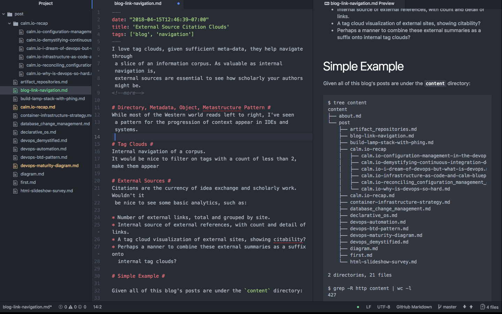

I love tag clouds, given sufficient meta-data, they help navigate through
 a slice of an information corpus. As valuable as internal navigation is,
 external sources are essential to see how scholarly authors are.
<!--more-->

# Directory, Metadata, Object, Metastructure Pattern #
While most of the Western world reads left to right, I've seen
 a pattern for the progression of context appear in IDEs and systems.

# Tag Clouds #
Internal navigation of a corpus.
It would be nice to filter on tags with a count of less than 2,
make them appear

# External Sources #
Citations are the currency of idea exchange and scholarly work. Wouldn't it
 be nice to see some basic analytics, such as:

* Number of external links, total and grouped by site.
* Internal source of external references, with count and detail of links.
* A tag cloud visualization of external sites, showing citability?
* Perhaps a manner to combine these external summaries as a suffix onto
  internal tag clouds?

# Simple Example #

Given all of this blog's posts are under the `content` directory:

<pre>$ tree content
content
├── about.md
└── post
    ├── artifact_repositories.md
    ├── blog-link-navigation.md
    ├── build-lamp-stack-with-phing.md
    ├── calm.io-recap
    │   ├── calm.io-configuration-management-in-the-devops-world.md
    │   ├── calm.io-demystifying-continuous-integration-delivery-and-deployment.md
    │   ├── calm.io-i-dream-of-devops-but-what-is-devops.md
    │   ├── calm.io-infrastructure-as-code-and-calm-blueprints.md
    │   ├── calm.io-reconciling_configuration_management_and_immutable_infrastructure.md
    │   └── calm.io-why-is-devops-so-hard.md
    ├── calm.io-recap.md
    ├── container-infrastructure-strategy.md
    ├── database_change_management.md
    ├── declarative_os.md
    ├── devops-automation.md
    ├── devops-btd-pattern.md
    ├── devops-maturity-diagram.md
    ├── devops_demystified.md
    ├── diagram.md
    ├── first.md
    └── html-slideshow-survey.md

2 directories, 21 files

$ grep -R http content | wc -l
427

$ grep -R http content

content/about.md: by the term [DevOps](https://en.wikipedia.org/wiki/DevOps).
content/about.md: on [LinkedIn](https://www.linkedin.com/in/marklavi)
content/about.md:You can follow Mark on [Twitter @calm_mark](https://twitter.com/calm_mark)
content/about.md: and [GitHub](https://github.com/mlavi)
content/post/artifact_repositories.md:* [Software Versioning](https://en.wikipedia.org/wiki/Software_versioning) at Wikipedia
content/post/artifact_repositories.md:* [Semantic Versioning](http://semver.org/)
content/post/artifact_repositories.md:* [GNU Coding Standards: Release Version Numbers](https://www.gnu.org/prep/standards/html_node/Releases.html#index-version-numbers_002c-for-releases)
content/post/artifact_repositories.md:on [DOAP: Description of a Project](https://github.com/edumbill/doap/wiki).
[Remainder omitted...]
</pre>
